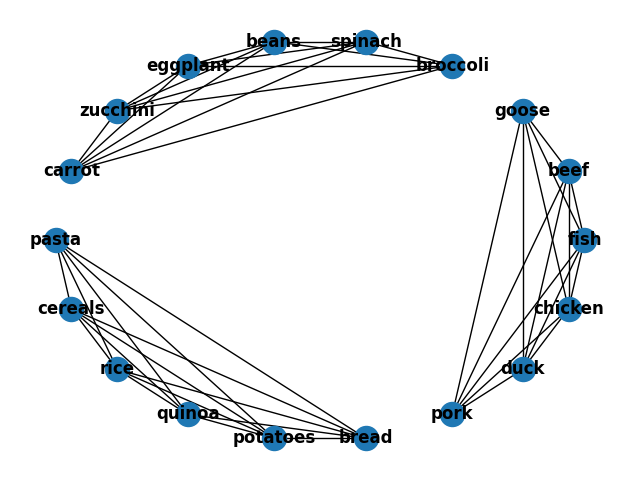
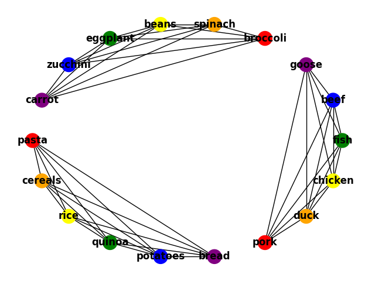

# Meal Planner

The program takes a CSV file as an input, reads the data, creates a conflict graph,
assigns colors to recipes using the graph coloring algorithm, and recommends recipes based on food item expiration date
or personal preference.


# How to use

1. Create a csv file, put all your food items into it. The data format is as the following:

```
Starches,Meats,Vegetables
rice (2023-05-01),chicken (2023-05-05),broccoli (2023-05-14)
pasta (2023-05-02),beef (2023-05-01),spinach (2023-05-18)
quinoa (2023-05-03),pork (2023-05-20),eggplant (2023-05-19)
bread (2023-05-05),fish (2023-05-22),zucchini (2023-05-11)
potatoes (2023-05-10),duck (2023-05-09),carrot (2023-05-25)
cereals (2023-05-14),goose (2023-05-11),beans (2023-05-11)
rice2 (2023-05-14)
```

**Note: As a default, one food item can only be eaten one day. If the user want to eat one food for many times, they
should add the item repeatedly**, e.g. rice1 (2023-05-01), rice2 (2023-05-01), rice3 (2023-05-01), etc.

2. Put the csv file in `src/`.
3. Refer to src/`meal_planner.py` and run it.
4. To set you preference, enter keyboard input in the console like the following:
```
Enter your favorite starch in the fridge: beans
Enter your favorite meat in the fridge: fish
Enter your favorite vegetable in the fridge: potatoes
```
Then you will get a list of meal plan with preference

# Graphs

Each food item will be a node.


Two vertices are connected if they cannot be part of the same meal



Color the nodes



Add edges for the nodes with the same color, i.e. can be a meal


# Output

```
############# Here are the food items in your fridge: ##############

rice: will expire in 7 days
beef: will expire in 7 days
pasta: will expire in 8 days
quinoa: will expire in 9 days
bread: will expire in 11 days
chicken: will expire in 11 days
duck: will expire in 15 days
potatoes: will expire in 16 days
goose: will expire in 17 days
zucchini: will expire in 17 days
beans: will expire in 17 days
cereals: will expire in 20 days
rice2: will expire in 20 days
broccoli: will expire in 20 days
spinach: will expire in 24 days
eggplant: will expire in 25 days
pork: will expire in 26 days
fish: will expire in 28 days
carrot: will expire in 31 days

############# Meal recommendation based on expired date ##############

Day 0: Recipe with cereals beef beans will expire in 4 days
Day 1: Recipe with rice goose zucchini will expire in 4 days
Day 2: Recipe with pasta chicken carrot will expire in 5 days
Day 3: Recipe with quinoa pork eggplant will expire in 6 days
Day 4: Recipe with bread duck spinach will expire in 8 days
Day 5: Recipe with potatoes fish broccoli will expire in 13 days
Enter your favorite starch in the fridge: beans
Enter your favorite meat in the fridge: fish
Enter your favorite vegetable in the fridge: potatoes
########### Meal recommendation based on your preferences ##############

Day 0: Recipe with cereals beef beans will expire in 4 days
Day 1: Recipe with potatoes fish broccoli will expire in 13 days
Day 2: Recipe with rice goose zucchini will expire in 4 days
Day 3: Recipe with pasta chicken carrot will expire in 5 days
Day 4: Recipe with quinoa pork eggplant will expire in 6 days
Day 5: Recipe with bread duck spinach will expire in 8 days
```

# Assumptions

- Each food item can be eaten one day only.
- Each food item has an expiration date.
- The user need to eat three kinds of foods every day: Starches, Meats, Vegetables.
- A recipe can't contain one type of food twice, e.g. you can't eat rice and pasta at the same time.

# Limitations

- Only one way to input the food items for the user
